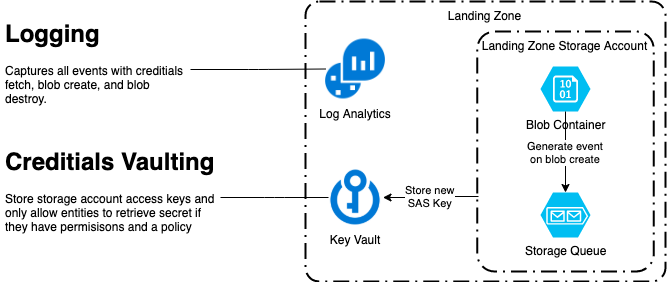

# terraform-azure-landing-zone


This pattern setups the landing zone infrastructure to receive data.



## Dependencies

This pattern uses the following

| Dependency | Description |
| ---------- | ----------- |
| bryannice/terraform-azure:1.2.0 | Docker image used to execute this pattern |
| bryan-nice/terraform-azure-modules?ref=1.1.0 | Terraform Azure module version used in this pattern |

## Docker Commands

Create landing zone:

```dockerfile
docker run \
    -it \
    --rm \
    --env SUBSCRIPTION_OWNER=<Owner of Azure Subscription> \
    -v ${PWD}:/home/terraform \
    bryannice/terraform-azure:1.2.0 \
    make tf-landing-zone
```

Destroy backend:

```dockerfile
docker run \
    -it \
    --rm \
    --env SUBSCRIPTION_OWNER=<Owner of Azure Subscription> \
    -v ${PWD}:/home/terraform \
    bryannice/terraform-azure:1.2.0 \
    make tf-destroy
```

Clean up files:

```dockerfile
docker run \
    -it \
    --rm \
    --env SUBSCRIPTION_OWNER=<Owner of Azure Subscription> \
    -v ${PWD}:/home/terraform \
    bryannice/terraform-azure:1.2.0 \
    make clean
```

## Make Targets

These make targets requires the Azure credential context before running. There is logic to check if it exists. If the required environment variables are not set, it will prompt the user to log in. All of these commands are expected to be excuted within the docker container bryannice/terraform-azure:1.2.0 or an environment with Terraform and Azure Cli installed.

| Variable | Description |
| -------- | ----------- |
| TF_VAR_SUBSCRIPTION_ID | Target Azure subscription ID |
| TF_VAR_TENANT_ID | Target Azure tenant ID | 
| TF_VAR_CLIENT_ID | Azure client ID to use |
| TF_VAR_CLIENT_SECRET | Azure client secret to authenticate |

To create the landing zone infrastructure

```makefile
make tf-landing-zone
```

To destroy the landing zone infrastructure

```makefile
make tf-destroy
```

To init terraform

```makefile
make tf-init
```

To apply terraform

```makefile
make tf-apply
```

To format the terraform files

```makefile
make tf-fmt
```

To clean up terraform files

```makefile
make clean
```

## License

[GPLv3](LICENSE)
